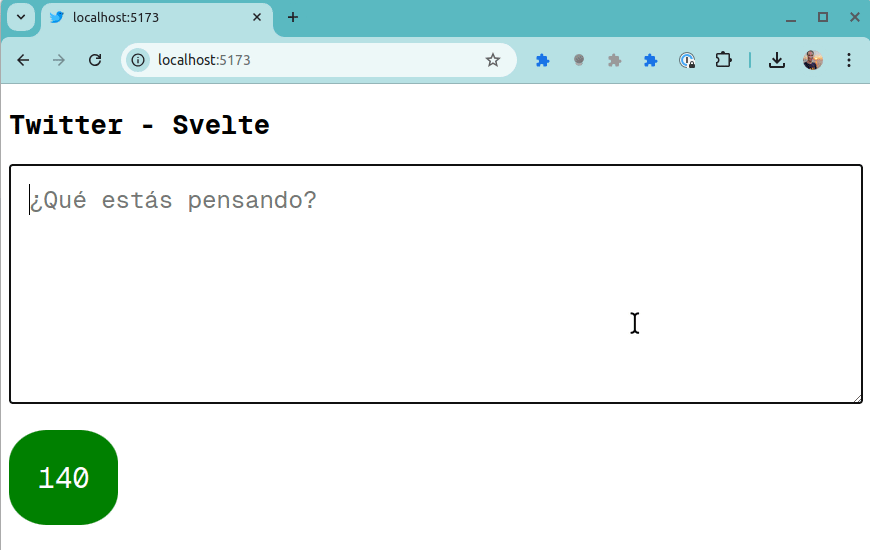

## Ejemplo Twitter en Svelte

[](https://github.com/uqbar-project/eg-twitter-svelte/actions/workflows/build.yml) [](https://codecov.io/gh/uqbar-project/eg-twitter-svelte)

El ejemplo muestra cómo podría funcionar una página de Twitter.

- Queremos replicar el comportamiento de twitter
- Escribimos en un texto, nos dice cuántos caracteres escribimos
- BONUS: que nos diga cuántos caracteres nos quedan
- BONUS 2: mostrarlo con colores distintos. verde si podemos escribir tranquilo, amarillo cuando falten menos de 5 y rojo cuando ya nos pasamos.

Ejercicio extraído de la [guía de binding](https://algo3.uqbar-project.org/gua-prctica-de-ejercicios/ejercicios-binding).



## Implementación

Tenemos

- como estado: el **tweet**, representado con un string
- un valor calculable o `$derived`, la **cantidad de caracteres restantes**
- otro valor calculable a partir de los caracteres restantes, **qué clase le corresponde**.

```sv
<script lang="ts">
	const LONGITUD_MAXIMA = 140

	const claseEspacioRestante = (restantes: number): string =>
		restantes > 10 ? 'ok' : restantes > 5 ? 'limite' : 'pasado'

	let tweet = $state('')
	let restantes = $derived(LONGITUD_MAXIMA - tweet.length)
	let espacioRestanteClass = $derived(claseEspacioRestante(restantes))
</script>

<article class="container">
	<h1>Twitter - Svelte</h1>
	<form name="form" class="form">
		<div>
			<textarea ...	bind:value={tweet}></textarea>
		</div>
		<div>
			<span data-testid="restantes" class="badge {espacioRestanteClass}">
				{restantes}
			</span>
		</div>
	</form>
</article>
```

## Test de frontend

En los tests decidimos

- testear el estado inicial: el tweet vacío y la cantidad de caracteres con el máximo posible. También testeamos que la clase css muestre los caracteres en verde.
- escribir una cantidad de caracteres que me deje todavía espacio para seguir escribiendo
- escribir una cantidad de caracteres que deje una cantidad negativa de caracteres para seguir escribiendo
- y testear las clases de css cuando estoy cerca del límite...
- ...o cuando me pasé

## Decisiones de diseño

El tweet es un string y la cantidad de caracteres restantes es una responsabilidad de la página. En otras variantes podríamos pensar en tener un objeto Tweet:

- que guarde internamente el texto
- y también sepa decirme la cantidad de caracteres

Hacer esto podría volverlo fácil de testear sin tener que pensar en tener una interfaz de usuario.

TODO: elaborar la otra variante.